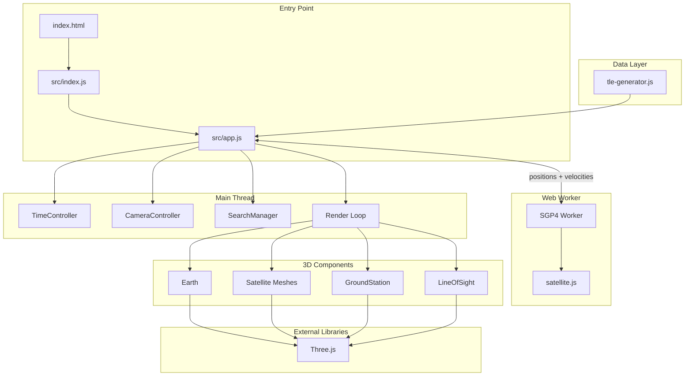

# Satorama Satellite Visualizer


**Real-time 3D satellite orbit visualization.** Watch up to 1,000 satellites orbit Earth with accurate SGP4 orbital mechanics, all running smoothly in your browser.

---

## ✨ Features

- **Real-time Orbital Propagation** — Uses SGP4/SDP4 algorithms via Satellite.js for accurate position calculations from TLE data
- **Multi-orbit Support** — Visualize LEO, MEO, GEO, and HEO satellites with distinct color coding and geometry
- **Ground Station Network** — Includes major spaceports (Kennedy, Baikonur, Kourou, Tanegashima) with automatic line-of-sight visibility calculations
- **Time Control** — Pause, fast-forward (up to 1000×), or reverse time to study orbital dynamics
- **Interactive Selection** — Click any satellite or ground station to view orbital parameters and track with camera follow mode

---

## 🏗️ Architecture



---

## ⚡ Performance Architecture

The visualizer is optimized to handle **10,000+ satellites at 60 FPS** through a multi-threaded architecture that separates physics calculations from rendering.

### Threading Model

```
┌─────────────────────────────────────────────────────────────────┐
│ MAIN THREAD (UI + Rendering)                                    │
├─────────────────────────────────────────────────────────────────┤
│ • Receives position + velocity buffers from worker              │
│ • Extrapolates positions each frame: pos + vel × Δt            │
│ • Updates Three.js meshes                                       │
│ • Handles user input, camera, UI                                │
│ • Renders at display refresh rate (~60 FPS)                     │
└───────────────────────────┬─────────────────────────────────────┘
                            │ Float32Array (transferable)
                            │ positions[n×3] + velocities[n×3]
┌───────────────────────────▼─────────────────────────────────────┐
│ WEB WORKER (SGP4 Physics)                                       │
├─────────────────────────────────────────────────────────────────┤
│ • Runs SGP4 propagation via satellite.js                        │
│ • Maintains simulation time (synced with time controls)         │
│ • Adaptive update rate based on time multiplier                 │
│ • Sends position + velocity for extrapolation                   │
└─────────────────────────────────────────────────────────────────┘
```

### Adaptive Physics Rate

The worker adjusts its update frequency based on time warp speed to balance accuracy vs CPU load:

| Time Warp | Physics Rate | Sim Time per Update | Rationale |
|-----------|--------------|---------------------|------------------------------------------|
| 1× | 10/sec | 0.1 sec | Real-time motion is slow; 10 Hz sufficient |
| 10× | ~31/sec | ~0.3 sec | Balanced for moderate acceleration |
| 100× | 60/sec | ~1.7 sec | Maximum rate for smooth visualization |
| 1000× | 60/sec | ~16.7 sec | Capped at 60 Hz; extrapolation fills gaps |

### Velocity Extrapolation

At high time warps (e.g., 1000×), physics updates occur every ~16ms real-time but represent ~16 simulation seconds. Without extrapolation, satellites would visibly "jump" between positions.

The solution: **linear extrapolation using orbital velocity**.

```javascript
// Each render frame (60+ FPS):
const dtReal = (now - lastPhysicsReceiveTime) / 1000;  // seconds since last physics
const dtSim = dtReal * timeMultiplier;                  // simulation seconds to extrapolate

// Extrapolate position using velocity (km/s)
position.x += velocity.x * dtSim;
position.y += velocity.y * dtSim;
position.z += velocity.z * dtSim;
```

For LEO satellites (~7.8 km/s orbital velocity), this provides sub-kilometer accuracy over short extrapolation windows, which is imperceptible at visualization scale.

### Memory Efficiency

- **Transferable buffers**: Position/velocity arrays are transferred (not copied) between threads
- **Shared geometries**: All satellite hitboxes share a single `SphereGeometry` instance
- **Visibility culling**: Satellites filtered by type skip mesh updates entirely
- **Throttled features**: Ground track (90 SGP4 calls) and orbital trail updates are throttled to 2-20 Hz

---

## 🚀 Quick Start

### Prerequisites

- Node.js 14+
- npm 6+

### Installation

```bash
# Clone the repository
git clone https://github.com/KeenDisregard/satorama.git
cd satorama

# Install dependencies
npm install

# Start development server
npm run dev
```

The app opens automatically at `http://localhost:3000`.

### Earth Textures

Download high-resolution Earth textures to `assets/textures/`:

| File | Description | Source |
|------|-------------|--------|
| `earth-blue-marble.jpg` | Surface texture | [NASA Blue Marble](https://visibleearth.nasa.gov/collection/1484/blue-marble) |
| `earth-topology.png` | Bump/height map | NASA |
| `earth-clouds.png` | Cloud layer | NASA |
| `earth-water.png` | Specular map | NASA |

---

## 📖 Usage

### Controls

| Action | Control |
|--------|---------|
| Rotate view | Left mouse drag |
| Pan view | Right mouse drag |
| Zoom | Mouse wheel |
| Select object | Click satellite/station |
| Follow object | Select → "Follow Object" button |

### Time Controls

```
⏸️ Pause    — Freeze simulation
1× to 1000× — Speed multiplier (1×, 10×, 60×, 100×, 1000×)
-1× to -10× — Reverse time
🔄 Reset    — Jump to current time
```

### Satellite Filters

Toggle visibility by orbit type:
- **LEO** (cyan) — Low Earth Orbit
- **MEO** (yellow) — Medium Earth Orbit
- **GEO** (magenta) — Geostationary Orbit
- **HEO** (red) — Highly Elliptical Orbit

---

## 🧪 Testing

```bash
npm test              # Watch mode
npm run test:run      # Single run
npm run test:coverage # With coverage report
```

Tests cover `TimeController`, `CameraController`, and `SearchManager`. See [OUTSTANDING.md](OUTSTANDING.md) for planned domain logic coverage.

---

## 🛠️ Tech Stack

| Technology | Purpose |
|------------|---------|
| [Three.js](https://threejs.org/) | 3D rendering engine |
| [Satellite.js](https://github.com/shashwatak/satellite-js) | SGP4/SDP4 orbital propagation |
| [Vite](https://vitejs.dev/) | Build tooling & dev server |
| [Vitest](https://vitest.dev/) | Unit testing framework |
| ES6+ JavaScript | Modular architecture |

---

## 📁 Project Structure

```
├── src/
│   ├── components/
│   │   ├── earth.js           # Earth globe with textures
│   │   ├── satellite.js       # Satellite mesh & orbit lines
│   │   ├── ground-station.js  # Ground station markers
│   │   ├── line-of-sight.js   # Visibility calculations
│   │   ├── satellite-trail.js # Selected satellite path trail
│   │   ├── ground-track.js    # Ground projection of orbit
│   │   ├── time-controller.js # Simulation time management
│   │   ├── camera-controller.js # Camera follow & zoom
│   │   └── search-manager.js  # Object search functionality
│   ├── workers/
│   │   └── sgp4-worker.js     # Web Worker for SGP4 propagation
│   ├── data/
│   │   └── tle-generator.js   # Synthetic TLE data generation
│   ├── app.js                 # Main application class
│   ├── index.js               # Entry point & UI bindings
│   ├── utils.js               # Helper functions
│   └── styles.css             # UI styling
├── tests/                     # Unit tests
├── assets/textures/           # Earth texture files
└── index.html                 # Application shell
```

---

## 🗺️ Outstanding Work

See [OUTSTANDING.md](OUTSTANDING.md) for planned improvements including:
- Domain logic test coverage
- Real TLE data import (CelesTrak/Space-Track)
- Orbit visualization enhancements
- Performance optimizations

---

## 🤝 Contributing

Contributions are welcome! See [CONTRIBUTING.md](CONTRIBUTING.md) for guidelines.

---

## 📄 License

[MIT License](LICENSE) © 2025 Evan Driscoll
